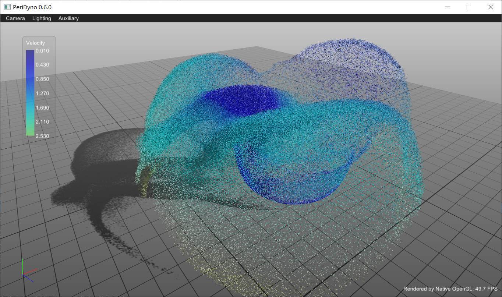
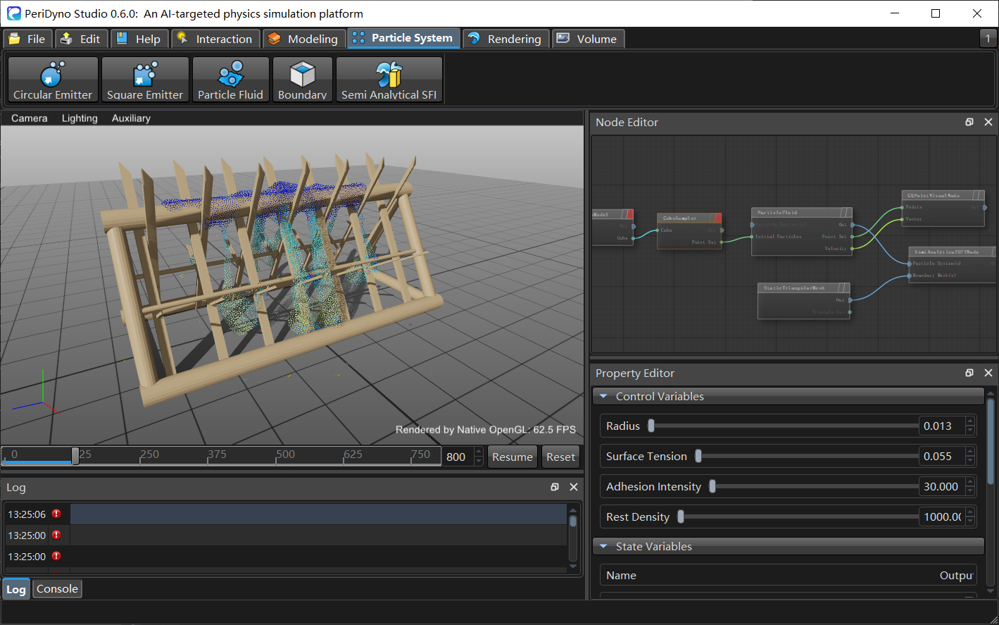

# Overview

PeriDyno is a CUDA-based, highly parallal physics engine targeted at providing real-time simulation of physical environments for intelligent agents. 

# Installation


## Platforms

**Windows 10**: fully tested

**Linux**: should work as well, yet not guranteed.

### Prerequisites:

IDE:

- Visual studio 2017+

CUDA:

- Latest tests were done based on CUDA Toolkit 11.4, should be compatible will other old versions.

Graphics:

- glad: https://github.com/Dav1dde/glad.git
- glfw: https://github.com/glfw/glfw
- imgui: https://github.com/ocornut/imgui

Optional:

- Qt: https://download.qt.io/
- VTK: https://github.com/Kitware/VTK
- Alembic: https://github.com/alembic/alembic
- Imath: https://github.com/AcademySoftwareFoundation/Imath

### Installation:

Aside from those optional, other libraries are integrated inside the project to simplify the installation. Use the following git command to download the project as well as other dependences.

```
git clone --recursive https://github.com/peridyno/peridyno.git
```

### Build the project:

Check whether CMake has been installed on your system, if not, visit https://cmake.org/download/ to download the lastest version. 

**Preferred**: Run cmake-gui.exe, set the top two entries with the source code and binary directories.  **Configure** the libararies you want to build, then click the **Generate** button to build the project. 

A more convient way to build the project with a default setting is as follows

```
cd peridyo/build 
cmake ..
```

# Applications

With a scene moded by PeriDyno, it can either be run as a GFLW application, Qt application or even a web application,  you don't need to change any code when switching between those applications.

- GLFW application



- Qt application

[](https://user-images.githubusercontent.com/66506655/185019397-5753c6a8-c88c-4e5a-aeab-dd837e3836ef.mp4)

# License

Peridyno's default license is the Apache 2.0 (See [LICENSE](https://github.com/peridyno/peridyno/blob/master/LICENSE)). 

External libraries are distributed under their own terms.
