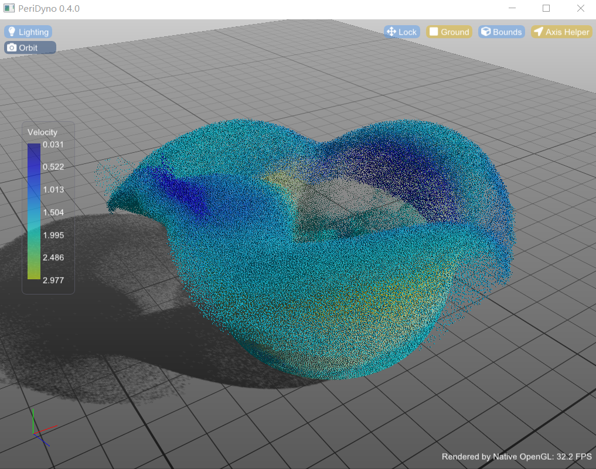

# Overview

PERIDYNO is a CUDA-based, highly parallal physics engine targeted at providing real-time simulation of physical environments for intelligent agents. 

# Installation


## Platforms

**Windows 10**: fully tested

**Linux**: should work as well, yet not guranteed.

### Prerequisites:

CUDA:

- Latest tests were done based on CUDA Toolkit 11.4, should be compatible will other old version.

Graphics:

- glad: https://github.com/Dav1dde/glad.git
- glfw: https://github.com/glfw/glfw
- imgui: https://github.com/ocornut/imgui
- Imath: https://github.com/AcademySoftwareFoundation/Imath

Optional:

- Qt: https://download.qt.io/
- VTK: https://github.com/Kitware/VTK
- Alembic: https://github.com/alembic/alembic

### Installation:

Aside from those optional, other libraries are integrated inside the project to simplify the installation. Use the following git command to down the project as well as other dependences.

```
git clone --recursive https://github.com/peridyno/peridyno.git
```


# Examples




# License

Peridyno's default license is the Apache 2.0 (See [LICENSE](https://github.com/peridyno/peridyno/blob/master/LICENSE)). 

External libraries are distributed under their own terms.
